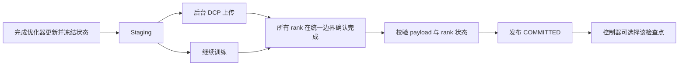

# TrainGuard 升级与优化评估

评估日期：2026-09-25（America/Los_Angeles）。代码基线：`06e2ef1`。依据：现有实现、已归档 CPU 实验、两次新增故障运行、控制器函数定向检查，以及下文列出的官方文档和研究论文。

## 1. 建议目标与执行顺序

下一阶段应同时提高三个能力：故障后能恢复到更近的已提交更新；恢复结论由一致、完整的证据支撑；性能数据能区分训练阻塞、后台 I/O、提交滞后和实际恢复时间。

建议先完成一个 CPU 升级包，再进入固定规模 GPU DDP，随后扩展真实数据与 FSDP2。多节点和拓扑变化需要单独的恢复契约。

| 顺序 | 升级项 | 直接收益 | 前置条件 | 完成标准 |
| --- | --- | --- | --- | --- |
| 1 / P0 | 完成证据校验与异常清理 | 避免不完整摘要发布成功，避免异常退出遗留工作组 | 现有 CPU 基线 | 非法证据有诊断；所有异常路径清理进程；既有完成窗口仍可恢复 |
| 2 / P1 | 计量保存各阶段与恢复全过程 | 找到实际瓶颈，建立优化前后对照 | 第 1 项 | 区分 upload 完成与观察完成；RTO 覆盖到全部 rank 恢复更新 |
| 3 / P1 | 异步保存提前提交 | 缩短可恢复状态滞后，改善首个检查点后的恢复可用性 | 第 2 项、统一 rank 协调 | 完成上传后在下一协调边界提交；一个在途请求；慢 rank 与异常 Future 均安全 |
| 4 / P1 | 检查点保留与按需扫描 | 限制磁盘增长，减少恢复时重复全量校验 | 第 1 项、清理与加载互斥 | 最新版本损坏仍可回退；删除中断可重试；加载候选仍完整验哈希 |
| 5 / P2 | 可续跑实验与可信性能对照 | 长实验中断保留已完成数据，建立可复现实验结论 | 新计量字段 | 原始值持续落盘；轮次去重；记录代码与环境；专用主机重复测量 |
| 6 / P2 | 固定规模 CUDA DDP | 验证真实加速器训练恢复 | 实际至少两张 CUDA GPU | 同环境参考与恢复一致；CUDA RNG、设备绑定、CPU 保存通信全部验收 |
| 7 / P2 | 真实数据、梯度累积与混合精度 | 覆盖实际训练状态 | 状态提供接口、GPU 基线 | 恢复样本、实际更新、调度器和 scaler 状态一致 |
| 8 / P3 | FSDP2、远程存储、多节点 | 支持更大模型与节点故障 | 前述恢复契约稳定、相应硬件与调度环境 | 每种拓扑、存储和故障类型都有独立验收 |

## 2. 现有证据能说明什么

上一轮验收记录为 53 项测试通过，18 次正式测量与 6 次预热全部通过最终状态和有效样本序列精确校验。该结果覆盖已实现的单机固定规模 CPU 契约。

以下数据来自[两种规模实验](../experiments/cpu-sizes-2026-09-25.md)，不是本次新性能实验：

| 模型 | 无保存训练中位数 | 同步训练中位数 | 异步训练中位数 | 同步／异步相对无保存的中位数差 | 每检查点 payload |
| --- | ---: | ---: | ---: | ---: | ---: |
| hidden 64，1 层 | 3.482 秒 | 3.862 秒 | 3.827 秒 | +10.90% / +9.90% | 1.414 MiB |
| hidden 128，2 层 | 9.580 秒 | 9.858 秒 | 10.086 秒 | +2.90% / +5.29% | 6.030 MiB |

这些百分比是不同模式中位数的描述性比较，不能当作隔离测出的保存开销。同步／异步范围在两个工作负载内均重叠。每种模式只有 3 次正式测量，主机没有隔离；目前没有证据认定异步保存稳定更快。

两组工作负载每次保存 30 个检查点。同步模式的 checksum + commit 累计中位数分别为约 0.109 秒和 0.220 秒；异步模式约为 0.108 秒和 0.223 秒。这部分工作在训练主线程的提交阶段执行，值得剖析。现有 `writing_seconds` 包含等待下一保存点的重叠训练，不能用它计算磁盘带宽。

## 3. 新发现与复现边界

### 3.1 异步检查点的可用性延后了一个保存周期

代码位置：`src/trainguard/trainer.py:163`、`src/trainguard/checkpoint_io.py:70`。

当前异步路径在保存点创建 `pending`，通常到下一个保存点才调用 `finish_save`、校验文件并发布 `COMMITTED`。训练结束时会排空最后一次保存。后台 DCP Future 的完成与应用层检查点可用于恢复是两个时刻。

新增定向实验使用同一 CPU 模型：训练 300 步，每 100 步保存，在第 150 步让 rank 0 退出。

| 模式 | 观察结果 | 恢复记录 |
| --- | --- | --- |
| sync | 成功完成训练 | 第二次尝试从 step 100 恢复 |
| async | 失败：没有有效已提交检查点 | step 100 目录有 DCP metadata 和两个 payload 文件，没有 manifest 和 COMMITTED |

完整证据见[定向实验 JSON](upgrade-evidence-2026-09-25.json)。本机原始记录保留在 `runs/upgrade-probe-2b0eade4cf7b/`。仅凭 payload 文件存在不能证明失败前所有上传操作已成功完成；本次证据确认的是该候选没有应用层提交，不能恢复。

代码推断：即使 I/O 很快，正常长训练也要等到下一保存点才提交。固定间隔为 I 步时，在已有检查点的稳定阶段、排除最终排空和写入超时，提交状态可能落后当前训练约 I 到 2I−1 步。首个保存点与下一保存点之间可能完全没有可恢复检查点。这是恢复可用性和提交延迟问题；拒绝加载未提交目录符合现有安全契约。

### 3.2 控制器的完成判断与离线校验器不同

代码位置：`src/trainguard/controller.py:193`、`:305`、`:416`；`src/trainguard/validation.py:99`。

已复现 `_valid_attempt_summary` 接受一份只有 run、attempt、配置指纹、总步骤和 world size 的匹配摘要，即使缺少 model、optimizer、scheduler 哈希。显式恢复路径会依据该 helper 返回的摘要发布成功；已成功的 run 还会直接返回。离线 `validate` 则要求最终哈希字段有效。

本次定向检查仅复现 helper 接受缺字段摘要，没有伪造一个完整成功运行。控制器可能发布不完整成功状态，是结合该结果与 `_drive` 分支得出的代码推断。

升级时应共用严格的摘要 schema，并核对每个 rank 的最终完成记录、最终步骤及完整有效步骤证据。完成摘要缺失、类型错误、身份错误或哈希缺失，都应得到明确的拒绝原因。无需未中断参考运行也能检查完成证据；与参考的张量／样本一致性比较仍由 `validate` 承担。

### 3.3 实时事件解析仍有异常退出路径

代码位置：`src/trainguard/controller.py:132`、`:245`。

已复现：向实时 rank 日志写入完整 JSON 行 `[]`，调用 `_read_events` 会触发 `AttributeError`；解析器没有先确认事件是 mapping。实时路径也使用 `isinstance(step, int)`，会接受布尔值作为整数；离线校验已使用严格整数检查。

风险推断：启动器运行后的未捕获解析／数据库异常可能让控制器退出，工作组继续运行。本次没有模拟整个工作组在该异常下遗留。下一轮需要实际进程测试，覆盖事件读取异常、PID 记录失败和检查点扫描异常，并验证 TERM／KILL 清理、状态记录及原始异常保留。

## 4. CPU 升级包的设计与验收

### 4.1 P0：统一证据 schema，保证异常后释放工作组

建议新增 `src/trainguard/records.py`，供 controller 和 validation 共用事件／摘要解析。严格检查 mapping、字段类型、run／attempt／rank 身份、步骤范围和摘要哈希。陈旧身份事件继续忽略；当前身份的坏记录应诊断；不完整尾行在写入过程中继续等待，在失败尝试的离线审计中保留已有截断规则。

控制器需要一个共同的完成证据校验函数，覆盖正常退出、控制器重启后协调、已成功 run 的轻量复核。它只负责证据完整性与一致性，不能单凭摘要哈希证明未保存的最终张量内容真实。

工作进程创建后，所有异常退出路径进入清理逻辑。清理失败需要与原始失败一起记录，避免后续恢复重叠启动。补充进程归属的参数边界、带空格路径、PID 重用及启动后 PID 尚未记录等用例。

验收用例：

- [ ] `test_resume_rejects_incomplete_final_summary`：缺失哈希／错误身份／错误总步骤不发布成功。
- [ ] `test_resume_requires_all_rank_completion`：一个 rank 缺少完成证据时不协调为成功。
- [ ] `test_controller_reports_nonmapping_current_event`：JSON 数组有明确诊断，控制器不因 `.get` 崩溃。
- [ ] `test_controller_exception_stops_owned_workers`：实际工作组启动后注入读取或入库异常，全部归属进程退出。
- [ ] 原有控制器完成窗口、零重试协调和离线回滚校验保持通过。

### 4.2 P1：补齐指标，再优化异步提交

建议在 `checkpoint_io.py` 的 `PendingSave` 中记录快照边界与各阶段的单调时钟，区分：

| 指标 | 定义 |
| --- | --- |
| state preparation | 构造模型和优化器状态所耗时间 |
| staging | 冻结／复制训练状态所耗时间 |
| upload completion | DCP Future 真正完成的时刻及从提交起的耗时 |
| main-thread wait | 主线程主动等待 staging 或 upload 的阻塞时间 |
| verification / commit | 验哈希、写 manifest、发布 COMMITTED 的耗时 |
| eligibility lag | upload 完成到 COMMITTED 发布之间的延迟 |
| recoverable step lag | 当前已完成更新减去最新有效已提交更新 |

Future callback 只记录完成时间／异常状态，主线程单独写审计事件。跨 rank 汇总使用相同定义的局部持续时间和最大值；多节点不能直接相减不同主机的单调时钟值。运行总耗时与各 rank 训练时间都应保留，避免只取 rank 0 掩盖慢 rank。

恢复过程应记录故障观察、旧组退出、候选选择、启动请求、工作组初始化、状态加载、全部 rank 首个恢复更新完成。当前 `restart_seconds` 是旧尝试完成到新尝试记录创建的间隔，没有覆盖整个启动／加载过程。新 RTO 定义为控制器观察到故障至全部 rank 首个恢复更新完成；故障发生至被观察的检测延迟另行记录。

指标明确后，将异步提交改为在统一更新边界检查完成状态：

默认设计保留一个在途请求。所有 rank 在相同的轮询边界参与协调，例如每 5 个更新检查一次；该数值需要用轮询开销与允许回滚预算评估。协调通信使用独立 CPU control group，避免与后台 DCP 的 collectives 混用。仅本 rank 的 `future.done()` 不能决定进入全组 barrier。任意 rank 的 Future 失败时，整组必须得到一致的失败结论；后台 callback 不执行分布式 barrier 或发布提交。

PyTorch 官方异步教程建议限制并发请求，并指出 CPU staging 缓冲区和 pinned memory 会增加内存压力。GPU 异步 staging 完成前，优化器不能修改正在复制的状态；staging 和 upload Future 的生命周期需要分别管理。[官方异步保存教程](https://docs.pytorch.org/tutorials/recipes/distributed_async_checkpoint_recipe.html)

验收用例：

- [ ] `test_async_commit_does_not_wait_for_next_save_interval`：所有上传已完成时，在规定协调边界提交，而不是等下一个保存周期。
- [ ] `test_one_slow_rank_blocks_commit`：一个 rank 尚未完成时绝不出现 COMMITTED。
- [ ] `test_async_future_failure_aborts_commit`：上传异常不发布标记，旧版本仍可恢复。
- [ ] `test_async_recovery_between_save_points`：先等待 step 100 已提交，再在 100 与 200 之间故障，恢复结果精确一致；不用固定睡眠推测 I/O 已完成。
- [ ] 直接重跑第 150 步故障场景作为观察，单独报告若上传尚未完成而不能恢复的结果。
- [ ] 轮询额外开销、提交滞后、CPU RSS 和单请求上限全部可测。

### 4.3 P1：保留策略与恢复扫描

当前没有保留上限。按本次较大模型约 6.030 MiB／检查点估算，假设每分钟保存一次、连续一天全部保留，payload 就约 8.48 GiB；这是假设频率下的容量估算。真实大模型需要按实际 payload 重新预算。

建议新增默认关闭的 `keep_last_k` 和容量预算；基线实验仍保留全部证据。开启保留时至少保留两个验证通过的提交版本，排除在途候选和正被加载的版本。先持久记录清理意图，再删除，最后记录完成；中断后按意图重试。删除前在控制器锁／明确生命周期互斥下复查版本，不能因“目录较旧”删除唯一有效回退点。

`commit_checkpoint` 对 payload 生成哈希后又完整校验一遍；`_scan_checkpoints` 会校验所有历史目录，并逐条提交 SQLite。失败后的控制路径可能再次扫描同一批候选。建议先优化恢复扫描：按候选步骤从新到旧完整校验，找到有效候选后停止；全历史审计作为显式操作。索引更新可按一次扫描批量事务写入。

候选排序只能用于选择校验顺序，不能代替 manifest 身份、文件集合、大小和 SHA-256 检查。缓存“上次验证通过”不能替代加载前验证。保存端减少重复读之前，先用分阶段指标测出收益，再验证写入时哈希或各 rank 分摊哈希的方案。

SQLite WAL 可改善同机并发读取，但现状只有一个控制器写入，收益需要测量；WAL 不能作为跨主机网络文件系统上的共享协调数据库。[SQLite WAL 文档](https://www.sqlite.org/wal.html)

验收：最新版本损坏时仍选择上一个完整版本；清理过程中退出可重试；只有一个有效版本时不删除；构造 100 个历史候选时，选择最新有效版本只完整验所需候选，最新几个损坏时按序回退。

### 4.4 P2：实验续跑、剖析和更有代表性的规模

当前 `benchmark.py` 到全部运行结束才写 `results.json`；中途失败保留了运行目录，却缺少完整汇总与统一续跑入口。建议每完成一个 warm-up／正式 run 就原子保存该行，保存失败原因与 phase；续跑时只补缺失轮次，并复核配置、代码版本和参考 run，避免重复计入统计。

正式数据新增代码 commit、dirty 状态、准确依赖版本、CPU／内存、文件系统、训练线程、环境开关和 RSS／GPU 内存峰值。现有负载快照保留。预热运行仍独立验证和归档。

性能协议建议：专用主机；至少两个独立实验批次；每个模式先预热，再按六种模式排列均衡并记录随机种子；每模式初始目标 12 次正式运行。根据实际波动和预先约定的最小有意义差异决定是否增加样本，不按达到某个漂亮结果停止。

在同一轮次中比较模式差值／比值，报告中位数、原始范围与适合该样本结构的置信区间。另建 64／256 MiB 合成状态的存储微基准，测量 staging、实际 upload、验哈希和加载；微基准不冒充完整训练加速结果。受控慢 writer 能检查背压和提交时序，实际磁盘结论仍需要真实存储实验。

对状态准备、DCP、hash、JSON 日志及模型计算分别做短窗口剖析。当前 `append_event` 每步打开／关闭文件，但没有逐步 fsync，不能把它描述成“每步强制落盘”。优化单进程长期开启的 writer 时，需要保留及时 flush、失败尾行处理和成功完成前 flush；样本证据不能随训练日志采样一起丢失。Profiler 的形状／堆栈跟踪有额外开销，诊断运行和正式计时应分开。[PyTorch Profiler](https://docs.pytorch.org/docs/2.10/profiler.html)

## 5. 检查点频率应以什么为目标

固定 100 步适合当前实验对照。实际训练应共同优化正常开销、回滚损失和恢复时间。

可先采用一个明确受限的一阶近似：

`W(T) ≈ C_eff/T + λ·(T/2 + L + R)`

- T：两个状态快照之间的有效训练时间。
- C_eff：每次保存带来的等效正常训练开销；异步情况下包含主线程阻塞和资源竞争，不能直接用 upload wall time 代入。
- λ：作业级故障率，不是单卡故障率。
- L：快照到可用于恢复的平均额外滞后。
- R：检测、清理、选择、启动和加载造成的恢复损失。

在故障独立稀疏、成本稳定、L 与 R 近似不依赖 T 的条件下，对这个近似求导得到 `T ≈ sqrt(2·C_eff/λ)`。相关 checkpointing 研究也同时计入正常保存与故障浪费，并讨论其故障分布与近似条件。[Checkpointing algorithms and fault prediction](https://arxiv.org/abs/1302.3752)

这里的异步扩展模型是工程近似，不是该论文给出的异步系统公式。当前实现的 L 会随保存周期增长，不能直接套用以上极值。应先缩短并测量提交滞后，再用实测／假设故障率做区间扫描。两次人工注入故障不能估计真实故障率。

策略的验收目标应是：在用户允许的最大回滚预算内，降低含重算的总完成时间；同时限制内存与磁盘占用。若上传持续时间经常超过快照间隔，一个在途请求会产生背压。优先报告预算不可满足并调整周期／存储吞吐，而不是无限增加请求队列。

## 6. GPU 与真实训练升级的关键依赖

### 6.1 先做固定两卡 CUDA DDP

本机实测 PyTorch 为 2.10.0，CUDA 不可用，MPS 可用。GPU 验收需要实际 CUDA 环境。

必要改动：按 `LOCAL_RANK` 绑定 GPU；模型与输入放到对应设备；训练通信使用 NCCL；保存与控制协调具备 CPU 通信后端；捕获并恢复每个 rank 的 CUDA RNG；在模型、优化器和通信初始化后恢复 RNG。不同物理卡映射需要核对逻辑设备身份。先用 FP32、固定拓扑和 dropout 跑参考／恢复，验证 dropout 的 CUDA RNG 负面控制。

CUDA RNG 的官方接口包括 `get_rng_state_all`，具体保存本 rank 使用的设备还是全部可见设备，需要按绑定方式固定契约。[CUDA RNG API](https://docs.pytorch.org/docs/2.10/generated/torch.cuda.get_rng_state_all.html)

验收包含 worker exit、保存中断、损坏、一个 rank 卡住，以及控制器退出。同设备、同版本、同拓扑先验证精确一致；若特定算子不支持确定性，先识别算子，再制定预先固定的数值容差，不能把 CPU 与 GPU 的差异混成恢复错误。[PyTorch 可复现性说明](https://docs.pytorch.org/docs/2.10/notes/randomness.html)

现有每步 `float(loss.detach())` 在 GPU 路径可能触发 CPU 等待设备结果；GPU 性能版应降低标量回传频率，并保持每个实际更新的样本审计。CUDA 计时必须定义同步边界，避免只测到 kernel 提交。

### 6.2 混合精度与梯度累积会改变恢复状态定义

当前约束是一次批量等于一次优化器更新，且 `next_data_step == global_step`。梯度累积中，多批数据对应一个更新；FP16 的 GradScaler 还可能因 inf／NaN 跳过优化器更新。这时消耗的批次数与成功更新数不同。[AMP 官方示例](https://docs.pytorch.org/docs/2.10/notes/amp_examples.html)

因此应分别记录成功优化器更新、消耗批次和累积边界。第一版只在完整累积更新结束后保存；中途保存还需要梯度 buffers 和累积阶段。scheduler 是否推进必须与实际更新语义一致。使用 scaler 时保存其状态；采用不需要 scaler 的 BF16 配置时不添加虚构的 scaler 状态。

建议新增一个小的训练状态提供接口，统一模型、优化器、调度器、scaler、RNG、数据状态和计数器的快照／恢复，逐个训练模式增加必要字段，避免继续把恢复细节全部写进 `train`。

### 6.3 真实数据与预取不能只保存整数游标

现在数据由 sample ID 直接确定，且 `num_workers=0`。真实数据需要记录数据集版本／内容清单、tokenizer 配置、sampler 的 shuffle RNG／epoch／位置，以及迭代数据集的分片和 worker 状态。预取队列中已读取但尚未用于成功更新的数据也要纳入恢复定义。

可评估 TorchData StatefulDataLoader，但需核对锁定版本和当前 PyTorch 的兼容性。官方教程给出 worker 状态聚合；Iterable 数据恢复要求相同的 `num_workers`。它不能替代应用对各 rank 同一更新边界的协调。[Stateful DataLoader 教程](https://meta-pytorch.org/data/main/stateful_dataloader_tutorial.html)

验收使用随机增强、两个 worker、预取、epoch 交界和非整批尾部，并比较实际生效样本顺序。仅“训练能继续”不能验收数据恢复。

### 6.4 FSDP2 与拓扑变化分两步

固定拓扑 GPU DDP 通过后，增加 FSDP2 `fully_shard` 路径。它使用 DTensor 参数，优化器在分片后构造；检查点读取、摘要生成和内存指标都要适配分片状态，避免无意聚合成全量模型。[FSDP2 官方文档](https://docs.pytorch.org/docs/2.10/distributed.fsdp.fully_shard.html)

先验收相同 world size 的恢复与每 rank 状态。DCP 支持加载时 resharding，不自动解决 world size 改变后的 RNG、样本分配、全局批量和训练轨迹语义。弹性拓扑需要独立设计与测试，不继承当前逐位一致性声明。

## 7. PyTorch 版本、耐久性与多节点

### 7.1 版本升级单独进行兼容性实验

官方已发布 PyTorch 2.14，其中包含动态进程组／单次 collective 超时控制和更多通信诊断能力。[2.14 官方发布说明](https://pytorch.org/blog/pytorch-2-14-release-blog/)

现有 2.10 本机代码已经具备 `DefaultStager` 和 `AsyncSaveResponse`，返回类型可为普通 Future 或 staging／upload 分离的响应；现有代码走默认 Future 路径。CPU 提前提交优化不依赖升级到新版本。GPU 引入新的 stager 后需要兼容两种返回类型，显式关闭资源，并满足 staging 完成前不得修改状态的约束。

保留 2.10 基线，在隔离环境做 2.14 候选矩阵：新环境的参考重复、完整恢复故障矩阵、各模式资源退出、旧检查点读取或明确拒绝、显式迁移方案。DCP 不保证跨 PyTorch 版本的检查点向后兼容；现有 manifest 还严格核对软件／PyTorch 版本。不能只改依赖后放宽比较并声称兼容。[DCP 2.10 文档](https://docs.pytorch.org/docs/2.10/distributed.checkpoint.html)

后续将读取兼容策略按 checkpoint format／state schema 显式版本化。需要迁移时保留原始检查点，转换到新目录，并单独验证转换后的模型、优化器、调度器和 RNG；不改写历史实验。

### 7.2 扩展耐久性先限定具体文件系统

当前 manifest／marker 先 fsync 临时文件再 replace，没有显式同步相应父目录；DCP writer 默认 `sync_files=True`。现有声明是进程故障恢复。若升级到 Linux 本地文件系统的主机重启耐久性，需要审计 payload、metadata、manifest、marker 与目录项的持久化顺序。Linux 的 fsync 文档明确指出，文件同步不一定同步包含它的目录项。[Linux fsync 文档](https://www.man7.org/linux/man-pages/man2/fsync.2.html)

验收应包含写满磁盘、EIO、只读目录，以及每个提交边界的进程退出；真实断电／重启仍需独立环境。测试 fsync 调用顺序不能证明任意存储硬件的断电保证。macOS、网络文件系统和对象存储各自需要独立说明。

### 7.3 多节点需要新的控制和存储契约

目前本地 `flock`、`ps` 和 `killpg` 不能管理远程节点生命周期。多节点阶段需明确调度器如何重启控制器／节点，谁拥有重试决策，以及旧控制者如何被 fencing epoch 阻止继续提交。SQLite 保留为单节点索引或改由一个明确的服务管理；不能直接放到共享网络目录作为分布式锁。

远程对象存储需要不可变对象、manifest／generation 和有条件发布的提交规则；不能把 POSIX replace 假定为远程多对象事务。先验证单机远程存储，再验证固定多节点拓扑，最后才考虑拓扑变化。

## 8. 下一轮最小交付

推荐下一轮只交付第 1 至 4 项 CPU 升级：

1. 统一完成与实时事件 schema，并在异常下清理实际工作组。
2. 记录真实 upload 完成、提交滞后、主线程等待和全过程恢复时间。
3. 在一致协调边界提前提交异步保存，保留单个在途请求和完整验证。
4. 提供默认关闭的保留策略，并改为按需要选择／验证恢复候选。

每项从失败用例开始，修正后验收既有 CPU 故障矩阵；最后进行一次整体审查。新报告同时给出恢复可用性、回滚损失和总完成时间。专用主机性能测量、实际 GPU 验收、真实数据以及多节点分别作为后续交付，不把它们的未验证性质计入本轮完成结果。
