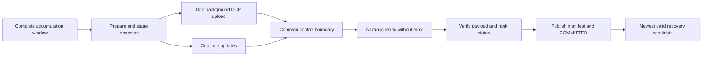

# Architecture

## Ownership and evidence

One local controller owns a run under `flock`, launches fixed-size `torchrun` with internal retries disabled, and records attempts/checkpoint selections in SQLite. An attempt is identified by run/attempt/rank IDs and a distinct directory. PID start identity and complete run argument values protect against PID reuse, prefix matches and orphan launchers. All post-spawn exception paths stop the owned group before returning. A controller error is preserved in the status and diagnostic file.

`records.py` shares strict parsing and summary checks. `validation.py` reconstructs effective update and batch evidence, including rollback. The controller uses this same completion audit for ordinary exit, controller restart reconciliation and already-successful resume. State hashes describe recorded rank states; they do not independently prove the contents of an unsaved final tensor.

## Training state and devices

`TrainingState` owns successful update count, consumed microbatches and optional GradScaler state. `data.py` supplies deterministic synthetic batches or immutable JSONL rows with reproducible shuffle/crop. A dedicated DataLoader generator prevents worker creation from perturbing training RNG. Consumption is logged separately from prefetch and successful optimizer updates. Accumulation checkpoints exclude partial gradient windows. Nonfinite scaled gradients are coordinated across ranks; skipped updates do not advance scheduler or update count.

`strategy.py` binds CUDA local rank, wraps DDP or applies FSDP2 bottom-up before optimizer construction, and hashes only local DTensor shards. Final summary combines ordered per-rank digests over Gloo, avoiding full model gathering. CUDA execution disables TF32 and nondeterministic attention alternatives for the initial exact contract; unsupported deterministic operators fail rather than switching tolerance silently.

## Save lifecycle

Training communication uses Gloo on CPU or NCCL on CUDA. Save and control each have a dedicated Gloo group. A Future callback records only monotonic completion time; it performs no distributed operation or log write. Main threads coordinate readiness, deadlines and errors, then publish the application transaction. Forced/final waits follow the same coordination rule. Atomic JSON/marker replacement includes file and parent directory synchronization.

Selection uses descending candidate order with full integrity verification until a valid version is found; full-history audit is explicit. `lifecycle.py` applies optional retention under controller ownership, with persisted deletion intent, loading protection, two fallback versions and a reported soft capacity budget. SQLite inspection updates are batched per scan. The save commit still verifies the payload twice; optimization of this read path needs a measured benefit and an independent integrity proof.

## Measurement and experiments

`controller.jsonl` records launch, fault observation, group stopped and selected checkpoint phases. Rank events record initialization, state loaded and first resumed update. RTO spans controller fault observation to all ranks completing their first resumed update; attempt allocation gap remains a separate compatibility metric.

`benchmark.py` persists slot state before/after each run, retains failures, checks source/runtime/configuration identity, reuses completed runs after coordinator interruption and resumes missing slots. Six mode permutations balance order; warm-ups are excluded, raw measurements and paired differences retained. `campaign.py` closes reference/recovery/negative-control acceptance with persistent case evidence. `storage_benchmark.py` measures payload save/hash/load independently of training. `policy.py` computes an explicit budget-constrained interval estimate without automatically changing training.

See [recovery semantics](recovery-semantics.md), [experiment protocol](experiment-protocol.md) and [upgrade acceptance](experiments/full-upgrade-2026-09-26.md) for scope and current evidence.
