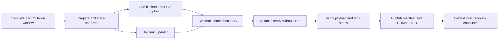

# Architecture

## Ownership and evidence

One local controller owns a run under `flock`, launches fixed-size `torchrun` with internal retries disabled, and records attempts/checkpoint selections in SQLite. An attempt is identified by run/attempt/rank IDs and a distinct directory. PID start identity and complete run argument values protect against PID reuse, prefix matches and orphan launchers. All post-spawn exception paths stop the owned group before returning. A controller error is preserved in the status and diagnostic file.

`records.py` shares strict parsing and summary checks. `validation.py` reconstructs effective update and batch evidence, including rollback. The controller uses this same completion audit for ordinary exit, controller restart reconciliation and already-successful resume. State hashes describe recorded rank states; they do not independently prove the contents of an unsaved final tensor.

## Training state and devices

`TrainingState` owns successful update count, consumed microbatches and optional GradScaler state. `data.py` supplies deterministic synthetic batches or immutable JSONL rows with reproducible shuffle/crop. A dedicated DataLoader generator prevents worker creation from perturbing training RNG. Consumption is logged separately from prefetch and successful optimizer updates. Accumulation checkpoints exclude partial gradient windows. Nonfinite scaled gradients are coordinated across ranks; skipped updates do not advance scheduler or update count.

`strategy.py` binds CUDA local rank, wraps DDP or applies FSDP2 bottom-up before optimizer construction, and hashes only local DTensor shards. Final summary combines ordered per-rank digests over Gloo, avoiding full model gathering. CUDA execution disables TF32 and nondeterministic attention alternatives for the initial exact contract; unsupported deterministic operators fail rather than switching tolerance silently.

## Save lifecycle

Training communication uses Gloo on CPU or NCCL on CUDA. Save and control each have a dedicated Gloo group. A Future callback records only monotonic completion time; it performs no distributed operation or log write. Main threads coordinate readiness, deadlines and errors, then publish the application transaction. Forced/final waits follow the same coordination rule. Atomic JSON/marker replacement includes file and parent directory synchronization.

Rank 0 broadcasts the result of checkpoint commit before any rank leaves the save collective. If publication raises an I/O or validation error, all ranks receive the failure and retain the original cause in the rank-0 traceback.

Selection uses descending candidate order with full integrity verification until a valid version is found; full-history audit is explicit. `lifecycle.py` applies optional retention under controller ownership, with persisted deletion intent, loading protection, two fallback versions and a reported soft capacity budget. SQLite inspection updates are batched per scan. Commit hashes each payload once and checks file identity before and after publication; recovery independently rereads every payload before loading it.

For completed local runs, validation, support export and benchmark measurement reuse read-only completion evidence checks. They verify the saved final checkpoint against its current transaction and state; guarded runs also require the customer-held sample key, two currently usable candidates, and the configured checkpoint byte and free-space limits before reporting success. The read-only audit does not repair checkpoints or establish that a storage service can survive host failure.

Each resumed rank records the selected manifest and its entry into DCP loading before it starts, then records completion of state loading. A worker's explicit load exception is durable evidence for excluding that manifest. For a load that stalls or ends without an exception, the controller records an incomplete restore only after it has stopped the whole owned group, every rank has matching entry evidence, and at least one rank has no completion evidence. An incomplete candidate is excluded from selection but retained for diagnosis; a failure before every rank enters the load does not condemn the checkpoint. Progress, selected-checkpoint events, and final recovery lineage are checked against the same attempt identity.

## Same-host reference experiment

The optional reference mode connects the ordinary two-rank CPU/Gloo synchronous DCP save path to a separate SQLite object store. Workers first finish the local DCP transaction. Under the run lock, the controller validates the complete committed tree, writes immutable generation payloads, seals their manifest and conditionally publishes HEAD. Recovery selects only HEAD-referenced generations, verifies stored sizes and hashes, materializes a private local cache, then performs the normal distributed state load. A damaged newer generation falls back to an older published candidate; local `COMMITTED` files without HEAD authority are ineligible. The controller drains final commits after the worker group exits and rechecks HEAD before reporting success. External validation and support export recheck the successful run's final checkpoint against HEAD without claiming a new epoch.

The reference database must be outside the run directory under a private, current-user-owned directory; its database and SQLite sidecars must remain private. The persisted epoch and conditional revisions support same-host restart and stale-token tests, while the run lock and local process checks supply isolation. This path is limited to the experiment profile, two CPU ranks, synchronous saves, bounded checkpoint bytes and eight HEAD candidates. It is not a service-backed object store, multi-host isolation authority, or evidence of host power-loss durability. The production training path still requires the actual storage and fencing implementation in the commercial closure plan.

## Measurement and experiments

`controller.jsonl` records launch, fault observation, group stopped and selected checkpoint phases. Rank events record initialization, state loaded and first resumed update. RTO spans controller fault observation to all ranks completing their first resumed update; attempt allocation gap remains a separate compatibility metric.

`benchmark.py` persists slot state before/after each run, retains failures, checks source/runtime/configuration identity, reuses completed runs after coordinator interruption and resumes missing slots. Six mode permutations balance order; warm-ups are excluded, raw measurements and paired differences retained. `campaign.py` closes reference/recovery/negative-control acceptance with persistent case evidence. `storage_benchmark.py` measures payload save/hash/load independently of training. `policy.py` computes an explicit budget-constrained interval estimate without automatically changing training.

See [recovery semantics](recovery-semantics.md), [experiment protocol](experiment-protocol.md) and [upgrade acceptance](experiments/full-upgrade-2026-09-26.md) for scope and current evidence.
