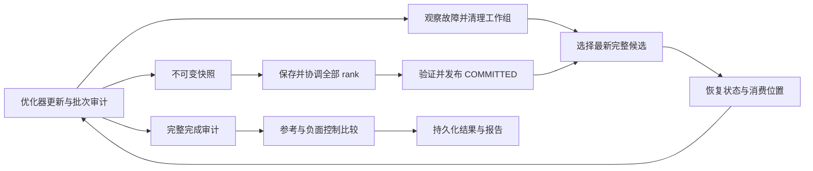

# TrainGuard 0.2 升级验收

日期：2026-09-26。基线 `60fb35f`；已验证的实现提交 `5f5d717907ea721921a9bf588a11a9d494908757`。实施计划：[全面升级](../plans/full-upgrade-2026-09-26.md)。

## 验收结论与来源

本机开发与 CPU 闭环已完成。CUDA／FSDP2 适配代码已实现，实卡验收开放；多节点与对象存储目前完成契约设计，实际集成仍需实施。断电耐久性、专用主机性能也保持开放。完整原始值、配置、运行目录和环境见 [验收数据](full-upgrade-2026-09-26.json)。

源码指纹：`72d2c2f8e4f7e5eef03b5caffc2aa431122266c9a1d9e1c9ff91aefcf0fa74a5`。覆盖训练包源码、项目配置及依赖锁；文档更新不改变指纹。实际实验开始时工作目录干净。

## 1. 已完成的升级

| 环节 | 升级内容 | 验收依据 |
| --- | --- | --- |
| 完成判定 | 严格摘要、全部 rank 完成、有效更新与消耗批次；成功续跑重新审计 | 缺日志、损坏摘要、重复／乱序、编码与 cursor 错误拒绝 |
| 控制器 | 进程创建后异常清理；PID 身份和完整参数归属；清理失败阻止重启 | 启动、PID 记录、文件提交、完成发布退出窗口测试 |
| 异步保存 | 共同更新边界提前提交；一个在途请求；协调失败、超时及最终等待 | step 150 故障实测与保存协调回归 |
| 计量 | 准备、staging、upload、等待、提交、eligible lag；完整恢复 RTO | 原始阶段事件与每 rank 资源统计 |
| 生命周期 | 默认关闭清理；至少两个有效版本；加载保护、删除重试、文件／父目录同步 | 保留、损坏回退、删除中断及 I/O 错误测试 |
| 实验续跑 | 持久化槽位；来源／运行时绑定；存活组阻止新建；原始计量复用 | 真实运行后的协调器异常与续跑；重复活动组回归 |
| 数据与状态 | 不可变 JSONL、确定性增强、双 worker 预取、梯度累积；消费与更新分离 | FP32／BF16、跨 epoch、9 行尾批精确恢复 |
| 设备／精度 | scaler 跳过更新与状态恢复；CUDA DDP、固定规模 FSDP2、分片摘要 | CPU scaler 非有限梯度测试；实卡门槛开放 |
| 闭环入口 | 10 类验收、存储微基准、受约束间隔估计；0.2.0／格式 2 | 两运行时测试、实际实验、构建与不兼容拒绝 |



## 2. 测试与发布检查

| 环境／检查 | 结果 | 记录 |
| --- | --- | --- |
| PyTorch 2.14.0、Python 3.12.12 | 94 通过、4 CUDA 跳过；228.81 秒 | [完整输出](evidence/full-upgrade-2026-09-26/pytest-2.14.txt) |
| PyTorch 2.10.0、同一新源码 | 94 通过、4 CUDA 跳过；227.28 秒 | [兼容测试](evidence/full-upgrade-2026-09-26/pytest-2.10.txt) |
| 静态检查 | `ruff check .` 通过 | 合入前复验 |
| 发布构建 | 0.2.0 wheel／源码包通过 | [构建输出](evidence/full-upgrade-2026-09-26/build.txt) |
| 独立整体审查 | 4 个主要问题、2 个次要问题关闭；独立回归 10 通过 | 第 6 节 |

2.10 测试有一条 DCP 内部 TypedStorage 弃用警告。两个运行时各自创建和比较检查点，不提供跨版本加载保证。

## 3. 实际恢复与数据验收

环境：macOS 26.5.1／arm64，10 个逻辑 CPU，24 GiB 内存，本地文件系统，2 个 Gloo rank，每 worker 1 个计算线程。原始运行根目录：`/Users/yitianwu/Documents/TrainGuard-recovery-validation/runs/full-upgrade-final-7c299d6dffd6`。

10 类 campaign 全部通过，并执行成功后的幂等续跑复核。每项记录 1 次恢复：

- 正面 7 项：同步／异步 worker 退出、同步／异步保存中断、同步／异步损坏、同步挂起；状态与有效样本／批次精确一致。
- 负面 3 项：省略 RNG、optimizer、cursor；训练完整成功、自身证据有效，参考比较出现限定差异。缺失或损坏证据不能算负面控制通过。

### 两个保存点之间的故障

300 更新、间隔 100、dropout 0.2，首个 attempt 在 step 150 退出。三个运行均与不中断参考精确一致：

| 模式／触发 | step 100 的提交更新 | 回滚候选 | 实际 RTO（秒） |
| --- | ---: | ---: | ---: |
| sync，step 150 退出 | 100 | 100 | 1.501351 |
| async，step 150 退出 | 105 | 100 | 1.377784 |
| async，要求 step 100 已提交后再退出 | 105 | 100 | 1.914717 |

异步快照已在下个保存点之前提交，可恢复更新滞后为 5。RTO 从控制器观察故障至全部 rank 首个恢复更新完成；每项仅一次本机观察，不能据此比较稳定恢复速度。

### 数据与续跑

- JSONL 夹具：双 worker、prefetch 2、shuffle、随机裁剪、累积 2、dropout 0.2。FP32／CPU BF16 分别执行参考与异步故障恢复；6 次更新、12 个消费批次，状态与有效序列精确一致。
- 独立 9 行夹具产生批量为 1 和 2 的尾批，跨 epoch 与恢复游标边界后仍精确一致。原始记录在 JSON 的 `tail` 字段。
- 在真实四步运行完成、原始行尚未归档时注入协调器异常；续跑复用同一运行和原始时长，补齐 9 个正式槽位。此异常为函数级注入；真实控制器退出窗口另有进程集成测试。

这些 token 输入是接口夹具，未验证真实语料的训练效果／吞吐。当前覆盖确定性 map-style 数据；任意第三方增强／Iterable 数据状态需专门适配。

## 4. 两规模重复基准

每规模 3000 更新、间隔 100；每模式 1 次预热和 6 次正式测量，覆盖六种排列。36 次正式测量加 6 次预热，42 次全部精确校验。长基准与测试套件串行运行，其他宿主机活动、缓存与温度未隔离。

下表为 worker 训练窗口，含保存，排除启动／初始化；完整运行时间、资源峰值与成对差值保存在验收 JSON。

| 模型 | 模式 | 中位数（秒） | 完整范围（秒） |
| --- | --- | ---: | ---: |
| hidden 64／1 层 | none | 5.036 | 3.712–8.290 |
| hidden 64／1 层 | sync | 7.219 | 4.415–12.251 |
| hidden 64／1 层 | async | 5.663 | 5.469–6.658 |
| hidden 128／2 层 | none | 11.615 | 11.135–16.116 |
| hidden 128／2 层 | sync | 12.959 | 12.140–16.894 |
| hidden 128／2 层 | async | 12.875 | 12.151–17.527 |

平均每检查点 payload 约 1.414／6.031 MiB。两规模同步／异步成对差值都有正负方向，范围重叠。异步提前提交正确性已验证，稳定性能优势尚未建立。历史基准源码／运行时不同，不能直接相减作为升级收益。

## 5. 存储测量与优化顺序

单 Gloo rank，64／256 MiB 张量，同步／异步各 3 次，共 12 次精确往返。下表为阶段中位数；阶段可能重叠，不能相加推导训练总时间。

| MiB | 模式 | staging（秒） | upload（秒） | hash＋commit（秒） | load（秒） |
| ---: | --- | ---: | ---: | ---: | ---: |
| 64 | sync | 0.0000 | 0.0795 | 0.0511 | 0.0060 |
| 64 | async | 0.0018 | 0.0744 | 0.0513 | 0.0060 |
| 256 | sync | 0.0000 | 0.3025 | 0.1925 | 0.0448 |
| 256 | async | 0.0055 | 0.3039 | 0.1927 | 0.0229 |

下一阶段按以下顺序推进：

1. 专用主机两批、每模式至少 12 次；固定负载、顺序与有意义差异，确认噪声和瓶颈后调整默认策略。
2. 对 256 MiB 的约 0.19 秒 hash／commit 做 I/O profile，拆解重复读取、哈希、fsync；优化维持完整性与发布顺序。
3. 实卡 profile staging、跨 rank 等待、AMP 有限梯度检查与 FSDP2 通信，并执行完整恢复矩阵。
4. 使用真实不可变语料验证吞吐；索引／mmap 分片适配后重新验收预取、尾批与恢复。
5. 使用实际 MTBF、等效开销、上传滞后及回滚预算调用 `checkpoint-budget`。JSON 中约 29.39 秒仅演示显式假设，MTBF 假设为 6 小时，未应用到训练。

## 6. 审查闭环

初查 `7c3d394`，修订后复核 `5f5d717`；下列六项关闭，未剩余合入阻断项：

| 问题 | 修复与验证 |
| --- | --- |
| 负面控制缺证据仍通过 | 自身完整审计、配置、实际恢复次数、限定差异；删除已通过摘要拒绝 |
| 复核耗时混入基准 | 原始时长／负载持久化；缺计量保留历史并重测；真实中断续跑验证 |
| 连续续跑绕过活动组 | 始终绑定旧 run；存活状态阻止新建；启动未返回按目录发现新 run |
| 失败参考／用例不能补跑 | 确认旧组退出后保留历史补跑；已验收证据损坏拒绝 |
| 编码／cursor 抛异常 | 返回失败诊断，UTF-8 与 cursor 回归通过 |
| 阶段标题错位 | 更正为 Upload／实际 Recovery RTO |

## 7. 开放门槛与执行规则

| 门槛 | 当前状态 | 关闭条件 |
| --- | --- | --- |
| CUDA DDP／FSDP2 | 代码已实现；0 张 CUDA、4 项跳过；入口 BLOCKED | 至少两卡，FP32／BF16／FP16、scaler、RNG、故障和资源退出 |
| 多节点 | 契约已设计，集成未实施 | 选定调度器／节点代理，实施并验证隔离、fencing、网络分区 |
| 对象存储 | 契约已设计，集成未实施 | 选定服务，实施并验证条件提交、损坏、删除、认证失败 |
| 断电耐久性 | 文件／目录同步已实现，断电未验收 | 指定 Linux 文件系统及独立 crash/reboot rig |
| 稳定性能 | 本机观察已归档，主机未隔离 | 专用主机、两批独立重复与预先固定的判定标准 |

执行契约见 [基础设施验收](../analysis/infrastructure-acceptance-2026-09-26.md)。CPU 通过结果不关闭这些后续门槛。

```sh
uv sync --group dev
uv run trainguard acceptance --config configs/cpu_demo.yaml --output-root runs
uv run trainguard acceptance-resume <acceptance-directory>
uv run trainguard benchmark --config configs/cpu_benchmark.yaml --repetitions 6 --warmups 1
uv run trainguard benchmark-resume <benchmark-directory>
uv run trainguard storage-benchmark --output-root runs
```

历史运行保留原件。格式 1／旧运行 schema、源码或依赖变化明确拒绝；回放使用原始源码和独立运行时。格式 2 的升级从新参考与新实验开始，不能修改 manifest 冒充迁移。设备／拓扑各自生成证据。实验当前状态以 `acceptance.json`／`results.json` 为准；既有报告保留生成时的观察结果。
